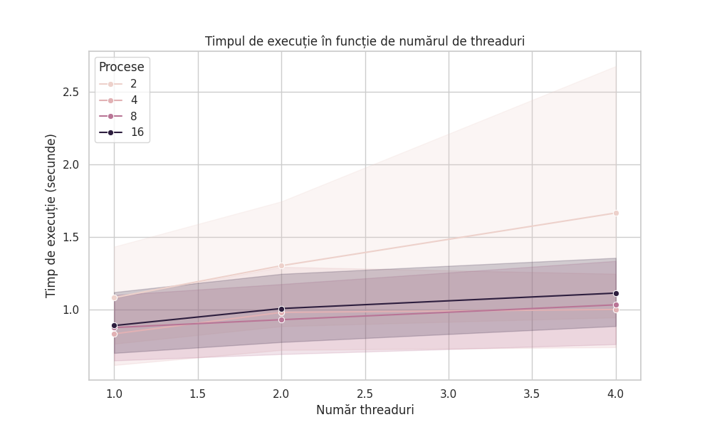
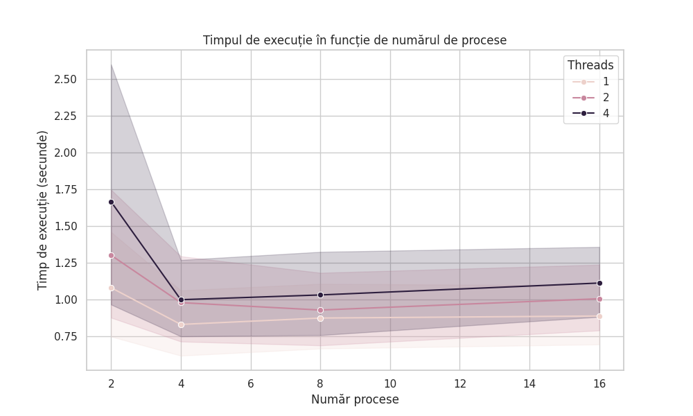
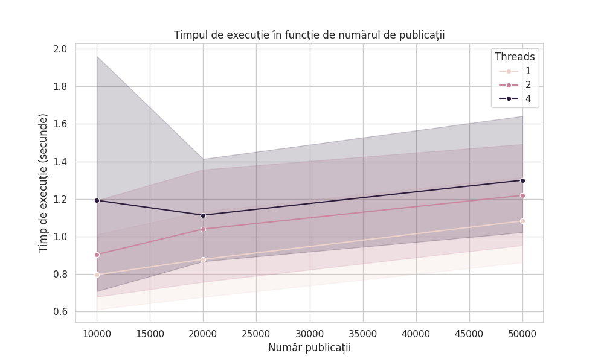
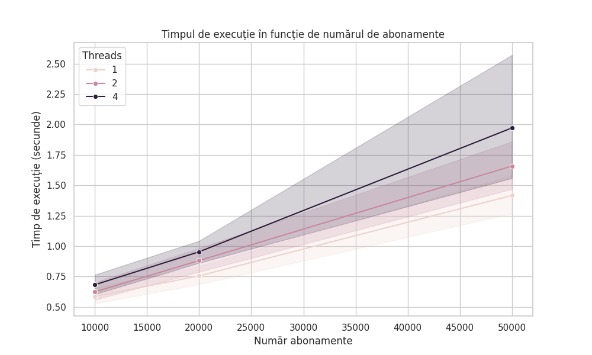
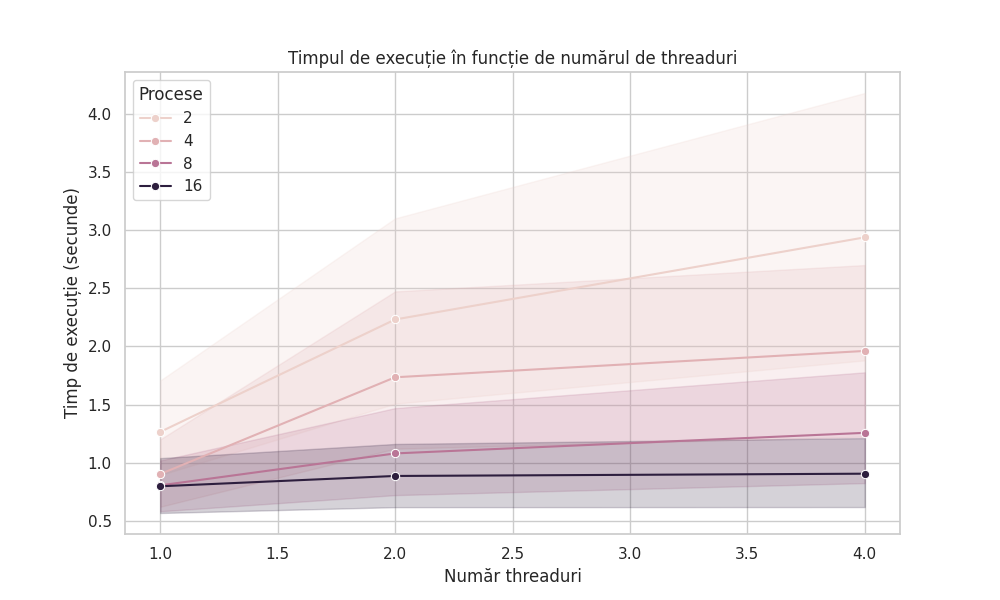
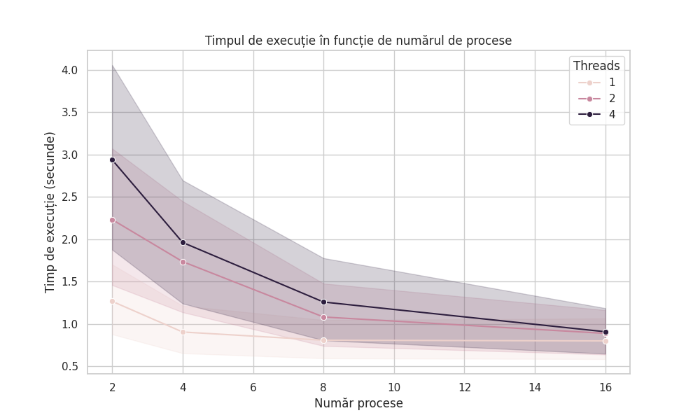
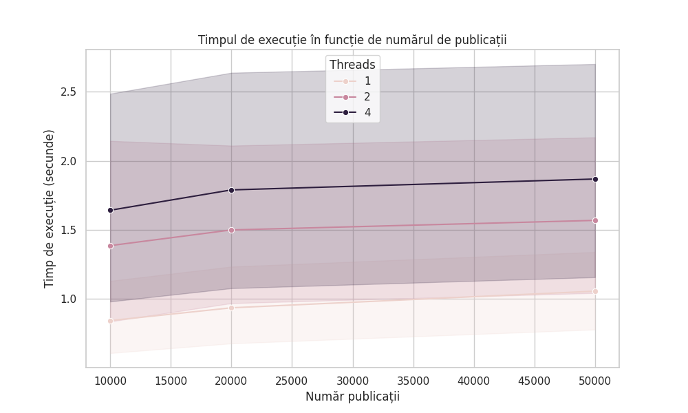
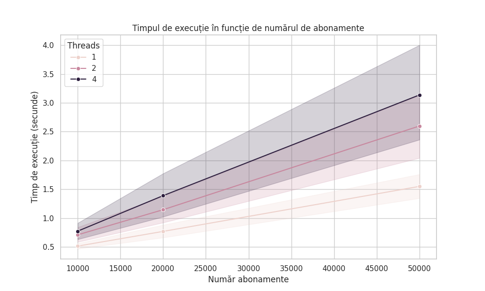

# Parameters Used

    Number of Publications: 10,000; 20,000; 50,000
    Number of Subscriptions: 10,000; 20,000; 50,000
    Number of Processes: 2, 4, 8, 16
    Number of Threads: 1, 2, 4

# Processor Specifications:

## Dan:

AMD Ryzen 5 4500U

- 6 Cores
- 6 Threads
- 15 W TDP
- 2.3 GHz Frequency
- 4 GHz Boost

### CPU:

Info: 6-core model: AMD Ryzen 5 4500U with Radeon Graphics bits: 64
type: MCP cache: L2: 3 MiB
Speed (MHz): avg: 1397 min/max: 1400/2375 cores: 1: 1397 2: 1397 3: 1397
4: 1397 5: 1397 6: 1397

### Results:






## Vlad:

Intel Core i7-8750H - 6 Cores - 12 Threads - 45 W TDP (Thermal Design Power) - 2.2 GHz Base Frequency - 4.1 GHz Turbo Boost

### CPU:

Info: 6-core model: Intel Core i7-8750H with Integrated Intel UHD Graphics 630 (45W) bits: 64
type: Mobile processor, cache: L2: 1.5 MiB, L3: 9 MiB
Speed (MHz): avg: 1397 min/max: 800/4100 cores: 1: 1397 2: 1397 3: 1397
4: 1397 5: 1397 6: 1397

### Results:






# Running

# RabbitMQ

```
docker run -d --hostname rabbitmqebs --name rabbitmqebs -e RABBITMQ_DEFAULT_USER=user -e RABBITMQ_DEFAULT_PASS=password -p 5672:5672 -p 5552:5552 -p 15692:15692 -p 15672:15672 rabbitmqebs
```

# Consumer

```
python main_2.py consumer 1000
```

# Filtering

Se pot pune numele field-urilor pe care se doreste filtrarea, cu spatii intre ele. Sau `all` pentru toate.

```
python main_2.py filter all
```

# Aggregator

La fel ca si la filtrare, se pot pune numele field-urilor pe care se doreste agregarea, cu spatii intre ele. Sau `all` pentru toate.

```
python main_2.py aggregate all
```

# Publisher

```
python main_2.py create_pubs 1000
```

# Clearing everything

```
python main_2.py clear
```
